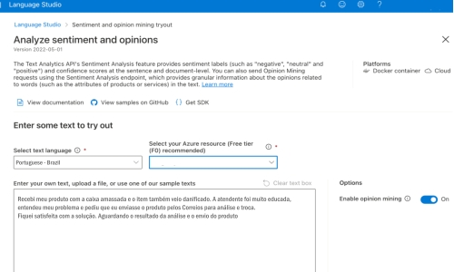

# Insights com Language Studio e Azure Speech Studio 

# utilizando IA para converter voz em texto e análise do atendimento

Uma empresa fictícia, especializada em vendas online, possui um call center para atendimento ao cliente e recebe a ligação de uma cliente relatando um problema com a entrega de seu pedido: Caixa danificada e produto amassado.

A funcionária do call center propõe solucionar o problema solicitando que o produto seja enviado de volta para a empresa, para análise e troca do produto.

A cliente aceita a proposta e, ao final do atendimento, responde a uma pesquisa de satisfação:

### Pesquisa de Satisfação Respondida pelo Cliente

Pergunta                                    Nota

-Atendimento da atendente................... 10

-Tempo de resposta à solução do problema......8 

-Se o problema foi resolvido..................8

-Se indicaria a empresa.......................9 

---

### Etapa 1: Conversão de Fala em Texto (Speech Studio)

A ligação foi gravada e processada por uma ferramenta de IA de reconhecimento de fala, sendo convertida em texto para posterior análise.

**Texto transcrito da ligação:**

> "Recebi meu produto com a caixa amassada e o item também veio danificado. A atendente foi muito educada, entendeu meu problema e pediu que eu enviasse o produto pelos Correios para análise e troca. Fiquei satisfeita com a solução. Aguardando o resultado da análise e o envio do produto"

---

### 🧠 Etapa 2: Análise de Sentimento e Frases-chave (Language Studio)

**Resultado da análise de sentimento:**

- **Sentimento geral:** Positivo
- 
- **Confiança:**
- 
  - Positivo: **88%**
  - 
  - Neutro: **10%**
  - 
  - Negativo: **2%**
  - 

**Frases-chave extraídas:**

- caixa amassada

- produto danificado
  
- atendente educada
  
- Devolução

-  Análise
 
- troca do produto
  
- Satisfeita

---

### 💡 Insights do Caso

- Mesmo diante de um problema inicial, o atendimento eficiente e a pronta solução contribuíram para uma percepção positiva da empresa.
  
- A IA identificou com precisão os sentimentos predominantes na fala, reforçando a utilidade da análise automatizada em ambientes de atendimento.
  
- As frases-chave destacam os pontos críticos da experiência do cliente, permitindo que a empresa monitore padrões e melhore seus processos.
  
- A pesquisa de satisfação reforça os dados da análise de sentimento, validando a eficácia da abordagem adotada pela atendente.

---

### Aplicação no Projeto

Este caso simulado demonstra como ferramentas de IA podem ser aplicadas para:

- Tradução em tempo real

- Converter fala em texto

- Monitorar a qualidade do atendimento ao cliente
  
- Identificar sentimentos e emoções em interações reais
  
- Gerar relatórios com base em dados objetivos
  
- Apoiar decisões estratégicas em empresas que lidam com alto volume de interações humanas
  

